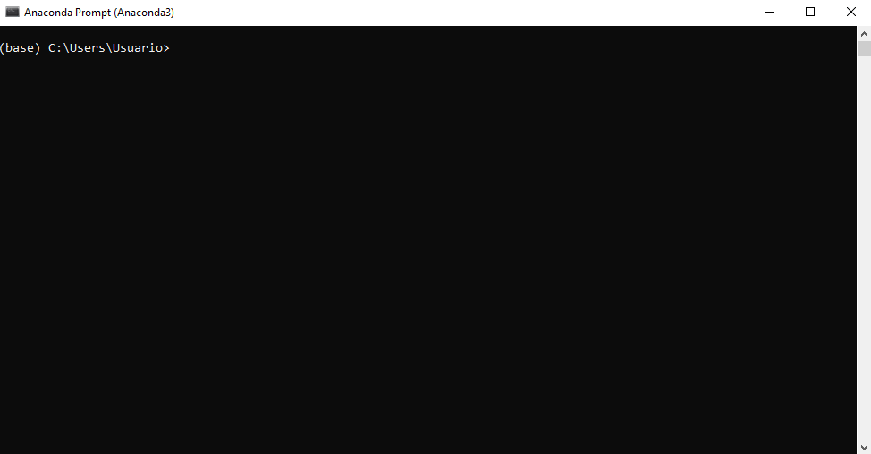

# Instalando Python 

En esta introducción, se explicará cómo instalar Python mediante la
distribución de [Anaconda](https://www.anaconda.com) pensando que puede 
facilitar el uso de Python a usuarios principiantes (no es necesario utilizar
Anaconda para seguir este curso, aunque sí que es recomendable instalar
[Jupyter Notebook](https://jupyter.org/) en caso de que no se opte por
la instalación de Anaconda).

## Descargando e instalando Anaconda

Para descargar [Anaconda](https://www.anaconda.com) haremos click en el
siguiente enlace:

[https://www.anaconda.com/distribution/#download-section](https://www.anaconda.com/distribution/#download-section)

y descargaremos Python 3.

Una vez descargado el archivo ejecutable, lo abrimos y seguimos los pasos
de instalación.

Como se ha comentado antes, Anaconda crea diferentes entornos de trabajo de forma cómoda y de distintos lenguajes de programación, como pueden ser Pyhton (vía Jupyter, Spyder o el propio Python) o R (vía RStudio). Su apertura se efectúa desde Anaconda Navigator y su terminal desde Anaconda Prompt.

## Instalando los módulos necesarios

Una vez instalado, vamos a instalar los módulos necesarios. 

> **Nota Importante:** Este curso se ha preparado con la versión 3.7 de Python, por lo que se tendrán que utilizar los entornos virtuales para el correcto funcionamiento del código, ya que actualmente Anaconda trae por defecto la versión 3.8 de Python.

Para ello, abriremos `Anaconda Prompt`:



Una vez abierto, nos colocaremos en la dirección que hemos descargado
el repositorio:

```bash
$ cd C:\path_to_repository\prevision-dia-tiempo-real
```

Crearemos el entorno virtual de Python 3.7, con el nombre de `Python37-versia-deusto` y después haremos que esté disponible en Jupyter, para poder seguir el curso mediante este entorno virtual:

```bash
conda create --name Python37-versia-deusto
```

(Activamos el entorno virtual)

```bash
conda activate Python37-versia-deusto
```

(Activamos el entorno virtual en Jupyter)

```bash
conda install -c anaconda ipykernel
```

```bash
python -m ipykernel install --user --name=Python37-versia-deusto
```

y una vez allí ejecutamos lo siguiente (instalamos los módulos necesarios):

```bash
$ pip install -r requirements.txt
```

Este proceso puede tardar varios minutos, pero a partir de entonces ya se habrán instalado todos
los módulos de Python necesarios para los siguientes ejercicios.

> **Nota Importante:** Para este curso se tendrá que utilizar el `Kernel` que acabamos de crear en Jupyter (`Python37-versia-deusto`), para que los módulos estén disponibles

# Instalando R dentro de Jupyter (contenido en Anaconda)

Jupyter nos permite abrir notebooks de lenguaje Python. Ahora le añadiremos la funcionalidad de apertura de notebooks de lenguaje R.

Jupyter es una herramienta muy interesante ya que permite trabajar mediante celdas, agilizando y dinamizando la tarea de desarrollo de modelos. Además permite insertar texto en formato Markdown, pudiendo poner estructura y comentarios con estilo para organizar o resaltar resultados en el código y a la vez crear informes. Debido a esta flexibilidad, es muy usado a nivel profesional en Data Science.

Para añadir el uso de R a Jupyter, se ejecuta nuevamente en Anaconda Prompt:

```bash
$ conda install -c r r-essentials
```

 >- Nota: Puede ser también necesario, ejecutar después:
 
```bash
$ install.packages(c(repr, IRdisplay, evaluate, crayon, pbdZMQ, devtools, uuid, digest), type=source)
$ devtools::install_github(IRkernel/IRkernel)
$ IRkernel::installspec(user=FALSE)
```

> Si hubiera complicaciones, seguir este [enlace](https://medium.com/@pabecer/instalar-el-kernel-de-r-en-jupyter-notebook-38bc724cc0d7)


