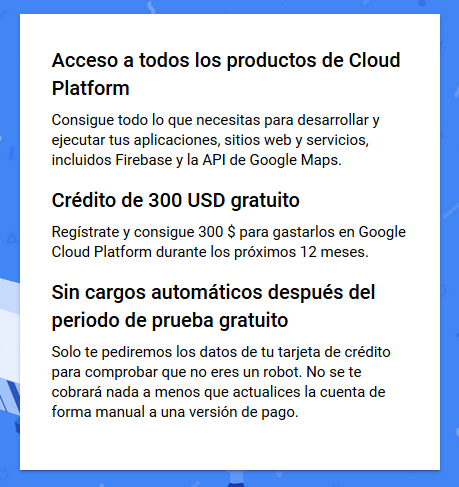
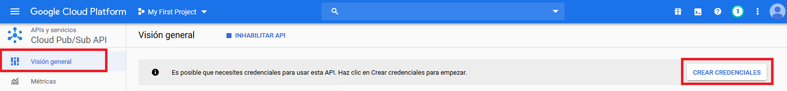
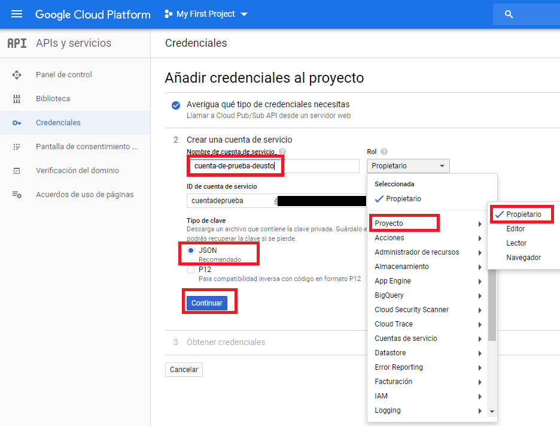

# Creando la cuenta de Google Cloud

En esta documentación se explicarán los pasos para crear y activar una cuenta
en Google Cloud, y cómo crear un *pipeline* en streaming mediante [PubSub](https://cloud.google.com/pubsub/docs/overview).

Por una parte vamos a crear un *tema* (*topic*) el cual va a estar *escuchando* todo el tiempo y le
podremos enviar los mensajes que queramos.

Por otro lado, vamos a tener una *suscripción* (*subscription*) en el que nos devolverá
todo aquello que nuestro *tema* haya *escuchado*.

1. [Creando la cuenta](#creando-la-cuenta)
1. [Activando un pipeline en streaming mediante PubSub](#activando-un-pipeline-en-streaming-mediante-pubsub)
    1. [Crear tema (topic)](#crear-tema-topic)
    1. [Crear suscripción (subscription)](#crear-suscripcin-subscription)
1. [Probando nuestro PubSub](#probando-nuestro-pubsub)
    1. [Creando credenciales](#creando-credenciales)
    1. [Comprobando mediante Python](#comprobando-mediante-python)
 
## Creando la cuenta

Para crear la cuenta en Google Cloud tenemos que acceder a la siguiente url y registrarnos:

[https://cloud.google.com/](https://cloud.google.com/)

 >- **Nota: Tendremos que dar un número de cuenta válido para esa activación, aunque
    sea para una versión gratuita**



Una vez activada la cuenta, accederemos a una pantalla inicial similar a la siguiente:


## Activando un pipeline en streaming mediante PubSub

Una vez estemos en la pantalla inicial, accederemos al apartado de PubSub
haciendo click en la parte superior izquierda:


De esa forma accederemos a PubSub:


### Crear tema (topic)

Empezaremos por crear un tema:


### Crear suscripción (subscription)

Y continuaremos creando una suscripción para una aplicación personalizada:


Para este ejemplo, elegiremos las siguientes opciones:


Por lo que con esto ya tendríamos activado nuestro PubSub

## Probando nuestro PubSub

Para probar nuestro canal de PubSub, vamos a activar las credenciales para la API
de PubSub.

### Creando credenciales








Una vez finalizado, tendremos descargado un archivo JSON (las credenciales) con el
que podremos acceder mediante Python u otros lenguajes tanto al *tema* como a la 
*suscripción* que acabamos de crear. Para abrir este archivo se usa el bloc de notas.

### Comprobando mediante Python

Una vez se han activado las credenciales de la API, podemos utilizar el
*notebook*

```bash
Comprobando Funcionamiento PubSub.ipynb
``` 

para comprobar que todo funciona correctamente.
