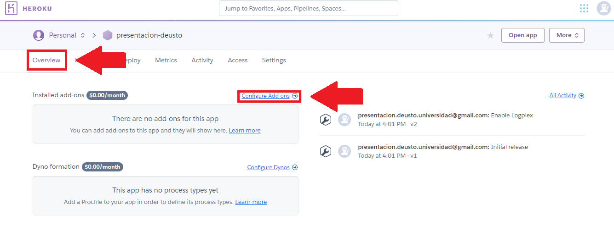

# Creando nuestra App en Heroku

En esta documentación se explicarán los pasos para crear y activar una cuenta
en [Heroku](https://www.heroku.com/), para después subir nuestra primera App. A esa
App le asignaremos más adelante una base de datos en [Heroku-Redis](https://devcenter.heroku.com/articles/heroku-redis)
para almacenar los datos que vayamos generando.

1. [Crear cuenta](#crear-cuenta)
1. [Creando nuestra primera App](#creando-nuestra-primera-app)
1. [Creando base de datos Redis](#creando-base-de-datos-redis)
1. [Resumen](#resumen)

## Crear cuenta

Para empezar, vamos a crear nuestra cuenta en [https://www.heroku.com/](https://www.heroku.com/)

Una vez rellenado los campos, nos enviarán un correo electrónico a la dirección
que hemos facilitado y haciendo click en ese enlace llegaremos a la siguiente
pantalla, donde tendremos que especificar una contraseña

Después de eso, habremos creado nuestra cuenta en Heroku de forma exitosa.

## Creando nuestra primera App

Una vez creada la cuenta, vamos a crear nuestra primera App

A continuación, elegimos un nombre que esté disponible

De esta forma ya hemos creado nuestra App en Heroku, aunque de momento esa App
esta vacía. Antes de llenarlo, vamos a crear una base de datos Redis para esta App:

## Creando base de datos Redis

Vamos a instalar nuestra base de datos Redis:

**Nota: aunque este *add-on* sea gratuíto, tendremos que meter una tarjeta de crédito
para que nos deje instalarlo**

Para comprobar que hemos instalado correctamente el *add-on* nos fijaremos en lo
siguiente:

## Resumen

En esta parte del curso hemos creado una App y una base de datos que todavía están
vacías. En el siguiente apartado veremos cómo vamos a llenar ambos campos.