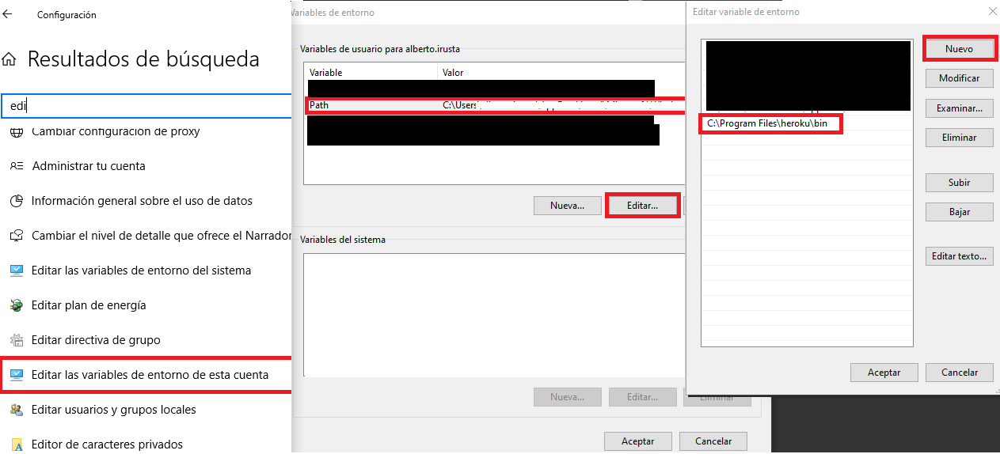

# prevision-dia-tiempo-real
Cálculo de la previsión de ventas en el día utilizando el stream de datos recibido por los puntos de venta (POS - por sus sigla en inglés).

1. [¿Qué resuelve este código?](#qué-resuelve-este-cdigo)
1. [¿A quién va dirigido este código?](#a-quién-va-dirigido-este-cdigo)
1. [Prerequisitos](#prerequisitos)
1. [Instalar R y RStudio para Fake Data y Python para crear modelos y su gestión](#fake-data)
1. [Crear una cuenta gratuita en Heroku.com](#crear-una-cuenta-gratuita-en-herokucom)
1. [Instalar Heroku](#instalar-heroku)
1. [Instalar git en tu ordenador](#instalar-git-en-tu-ordenador)
1. [Cómo seguir el curso](#cómo-seguir-el-curso)
1. [Diagrama general del curso y del ecosistema montado](#diagrama-general-del-curso-y-del-ecosistema-montado)


# ¿Qué resuelve este código?

Mediante el uso de una regresión aplicada a los datos históricos de ventas y al stream de datos recibidos en tiempo real por las Terminales Punto de Venta (TPV o POS - por sus siglas en inglés) se obtiene una previsión de las ventas diarias y se compara con la previsión de ventas estimadas en el plan de negocio.


# ¿A quién va dirigido este código?

A todo el mundo que desea compartir conocimiento.

A cualquier persona interesada en la mejora cuantitativa de las cadenas de suministro.

A cualquier persona interesada en aplicar técnicas de análisis de datos en tiempo real.

# Prerequisitos

Para la utilización de este código es necesario utilizar un conjunto de herramientas cuyo coste económico es cero €. 

## Instalar R y RStudio para Fake Data y Python para crear modelos y su gestión

Los datos utilizados en este proyecto son Fake. Para ello utilizamos el lenguaje R y un IDE (entorno integrado de desarrollo) muy utilizado, RStudio. En orden y respectivamente, se instalan a partir de los siguientes enlaces:

  -R proyect:  https://cloud.r-project.org/
  
  -RStudio Desktop free: https://rstudio.com/products/rstudio/download/

 Una vez instalados, usaremos únicamente RStudio cuya interfaz es más amigable que la del propio R.

Alternativamente y habiendo instalado R proyect, se puede desde Anaconda (https://www.anaconda.com/distribution/) usar
 Jupiter para ejecutar los notebooks de R (__recomendado__). Anaconda reune múltiples entornos de trabajo y de distintos lenguajes. Además, por su sencillez y configuraciones, posee gran relevancia a nivel profesional. 
 
La ventaja de esta opción reside en que está conectado con Pycharm y GitHub (esto es muy importante a nivel profesional, ya que posee _control de versiones_). Más adelante, se expondrán los detalles de los pasos a seguir para instalar Phyton y Anaconda e integrar en Jupiter el notebook de R.

## Crear una cuenta gratuita en Heroku.com

Heroku es una plataforma en la nube que permite construir, entregar, supervisar aplicaciones y alojarlas en la nube. En otras palabras, ofrece servicios de servidores y redes administrados por Heroku en donde se pueden alojar aplicaciones de diferentes lenguajes de programación como Python, Java, PHP y más. Por ello, no hay que preocuparse por su infraestructura, únicamente en desarrollar la aplicación.

Heroku utiliza contenedores Linux (Ubuntu) los cuales son llamados “dynos”, estos son utilizados para alojar las aplicaciones web, webservices o aplicaciones que se ejecutan del lado del servidor, así mismo cuenta con la posibilidad de instalar add-ons para agregar funcionalidades a dichos contenedores, por ejemplo, se pueden agregar servicios administrados de base de datos, almacenamiento en la nube, etz.

En resumen, esta plataforma nos permite ejecutar el código generado en la nube sin coste, además de servicios de bases de datos.

> Creación de una cuenta gratuita en Heroku.com:

  ```bash
  en tu navegador preferido:
  https://signup.heroku.com/login
  ```
  
## Instalar Heroku

 ```bash
https://devcenter.heroku.com/articles/heroku-cli
   ```  

Una vez instalado, para comprobar que esté todo correcto, abrir una terminal e insertar:

  ```bash
  $  heroku --version
  heroku/7.35.0 win32-x64 node-v12.13.0
  ```

En caso de error, hay que modificar la dirección donde apunta. Para ello proceder como sigue:



## Instalar git en tu ordenador

Git es la herramienta que permitirá que el código que modifiques en tu ordenador se pueda "subir" a la nube de Heroku. Git aporta muchas más cosas pero queda fuera del objeto de esta guía detallar Git. Si estás interesado te recomendamos este libro: [Gitbook](https://git-scm.com/book/es/v2)

0. Antes de instalar Git en tu ordenador, [Crea una cuenta gratuita en Github](https://github.com/)

1. [Instalando Git en tu ordenador](https://git-scm.com/book/es/v1/Empezando-Instalando-Git)

2. Si tu ordenador es un Mac, te recomendamos que utilices la opción de [Brew.](https://brew.sh/index_es)

Una vez instalado, para comprobar que esté todo correcto, abrir una terminal e insertar:

  ```bash
  $  git --version
  git version 2.24.0.windows.2
  ```

## Cómo seguir el curso

Este curso se divide en 5 bloques:

###### 0.</li> Pasos previos

###### 1.</li> Creando el modelo predictivo

###### 2.</li> Creando la cuenta de Google Cloud

###### 3.</li> Creando la cuenta de Heroku

###### 4.</li> Subiendo la App a Heroku

Se recomienda seguir los 5 bloques en el orden indicado, aunque para el usuario
que conozca cómo crear cuentas en Google Cloud y/o en Heroku puede saltarse los
pasos 2 y 3 respectivamente.

## Diagrama general del curso y del ecosistema montado


